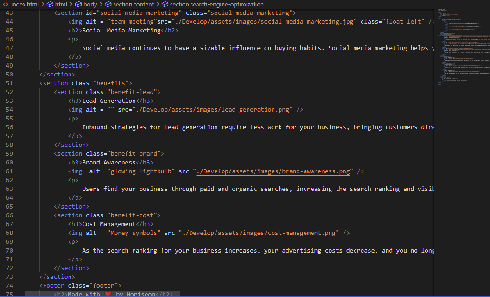

# Code Refactor

## Description 

This program is a website for a social media marketing firm. The edits that I've made to it enable the code to look more streamlined. By doing so, the programmer/viewer is able to glance at the code and easily recognise the different elements and aspects of the website.

## Installation

Github[https://github.com/]
Gitbash[https://git-scm.com/downloads]
Gitlabhttps://gitlab.com/[]
VScode[https://code.visualstudio.com/]
Google.com

## Code Snippets

<a href = "./Develop/assets/images/Screenshot-81.png">
<a href = "./Develop/assets/images/Screenshot-82.png">
<a href = "./Develop/assets/images/Screenshot-83.png">

## Author(s)

Matthew To(Me)

## Relevant links
Deployed site:https://mt722.github.io/Code-refactor/#social-media-marketing
Github Repository:https://github.com/MT722/Code-refactor

## Features

Includes nav links.

## License
Licensing not applicable